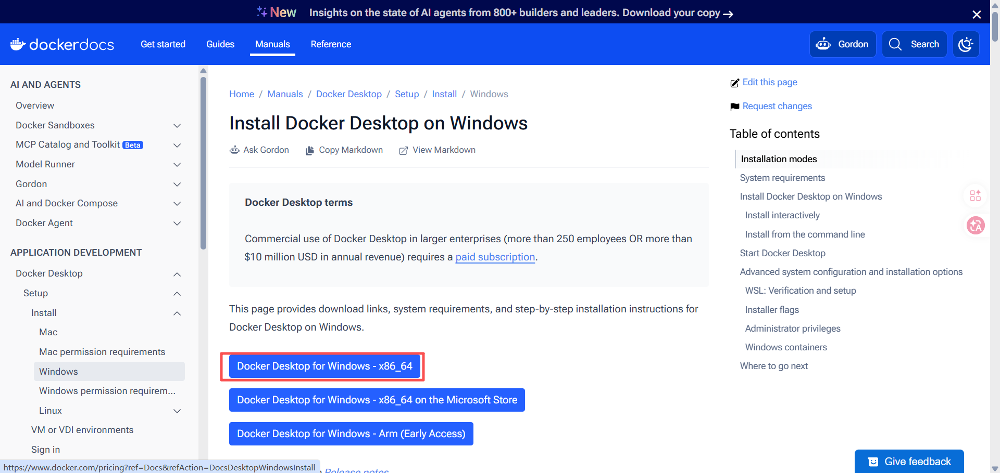

# 创伤地图和伤情预测系统 — 部署指南

---

## Windows

### 安装 Docker Desktop

1. 下载安装 Docker Desktop：https://docs.docker.com/desktop/install/windows-install/
> 
> 若有问题，可参考：https://blog.csdn.net/xin_yao_xin/article/details/159463946?ops_request_misc=elastic_search_misc&request_id=a5ccc39d0a38a84ea93100aa86156f21&biz_id=0&utm_medium=distribute.pc_search_result.none-task-blog-2~all~top_positive~default-1-159463946-null-null.142^v102^pc_search_result_base2&utm_term=docker%20desktop&spm=1018.2226.3001.4187
2. 安装后重启电脑
3. 安装 Git：https://git-scm.com/download/win

> 安装 Git 后，右键桌面 → **Git Bash Here**，后续所有命令在 Git Bash 中执行（不要用 cmd 或 PowerShell）。

```bash
docker --version
git --version
```

### 部署

```bash
git clone https://github.com/hfutwz/tongji-hospital-docker.git
cd tongji-hospital-docker
docker compose up -d
```

> 若 git clone 失败：浏览器打开 https://github.com/hfutwz/tongji-hospital-docker → Code → Download ZIP → 解压 → 在解压目录打开 Git Bash 执行 `docker compose up -d`。

```bash
curl http://localhost/
curl http://localhost:9090/api/patient/list
curl http://localhost:8000/
curl -X POST http://localhost:8000/api/model/train
```

浏览器打开 http://localhost，账号 `admin` / `hos123`。

---

## Mac

### 安装 Docker Desktop

1. Apple Silicon：https://docs.docker.com/desktop/install/mac-install/
2. Intel：https://docs.docker.com/desktop/install/mac-install/

```bash
docker --version
```

### 部署

```bash
git clone https://github.com/hfutwz/tongji-hospital-docker.git
cd tongji-hospital-docker
docker compose up -d
```

> 若 git clone 失败：浏览器打开 https://github.com/hfutwz/tongji-hospital-docker → Code → Download ZIP → 解压 → 终端进入解压目录执行 `docker compose up -d`。

```bash
curl http://localhost/
curl http://localhost:9090/api/patient/list
curl http://localhost:8000/
curl -X POST http://localhost:8000/api/model/train
```

浏览器打开 http://localhost，账号 `admin` / `hos123`。

---

## Linux

### 安装 Docker

```bash
# Ubuntu / Debian
curl -fsSL https://get.docker.com | sudo sh
sudo usermod -aG docker $USER
# 退出重新登录

# CentOS / RHEL
curl -fsSL https://get.docker.com | sudo sh
sudo usermod -aG docker $USER
# 退出重新登录
```

```bash
docker --version
```

### 部署

```bash
git clone https://github.com/hfutwz/tongji-hospital-docker.git
cd tongji-hospital-docker
docker compose up -d
```

> 若 git clone 失败：浏览器打开 https://github.com/hfutwz/tongji-hospital-docker → Code → Download ZIP → 解压 → 终端进入解压目录执行 `docker compose up -d`。

```bash
curl http://localhost/
curl http://localhost:9090/api/patient/list
curl http://localhost:8000/
curl -X POST http://localhost:8000/api/model/train
```

浏览器打开 http://localhost，账号 `admin` / `hos123`。

---

## 常用命令

```bash
docker compose ps                      # 查看容器状态
docker compose logs -f <容器名>         # 查看日志
docker compose stop                    # 停止
docker compose start                   # 启动
docker compose down -v                 # 删除所有数据
```

## 访问入口

| 地址 | 内容 |
|------|------|
| http://localhost | 系统首页 |
| http://localhost:8000/docs | 预测 API 文档 |
| http://localhost:15672 | RabbitMQ 管理后台（guest/guest） |